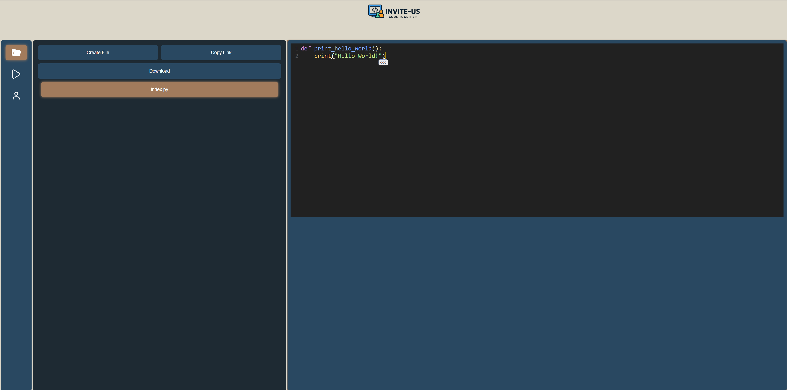
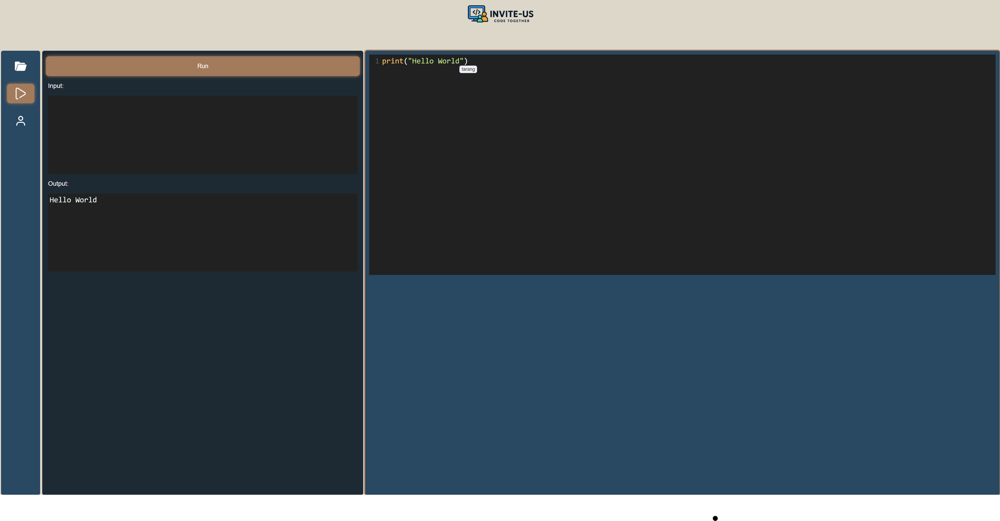
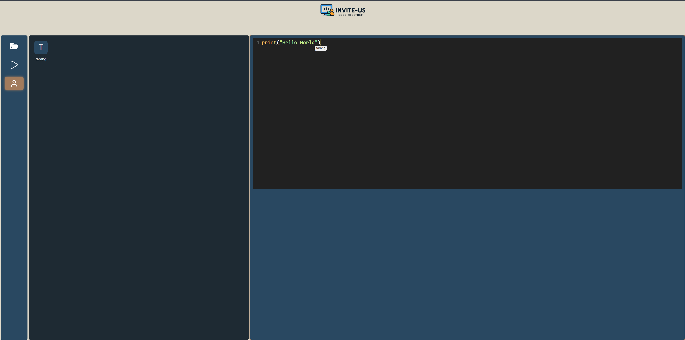

# 🖥️ Invite-Us

**Invite-Us** is a shared coding space you can open in your browser. Think of it like Google Docs, but for code. Multiple people can write, edit, and run code together in real time, without any setup hassle.

---

## ✨ Key Features
- **Real-time teamwork** – Everyone sees changes instantly.
- **Private coding rooms** – Start your own session or join a friend’s.
- **Instant updates** – Powered by WebSockets for smooth collaboration.
- **Run code directly** – Supports different programming languages.
- **Smart editor** – Syntax highlighting makes code easier to read.
- **File control** – Create, rename, or delete files.

---

## 🚀 Quick Start

1. Clone the repository:
   ```bash
   git clone https://github.com/tarang5757/invite-us.git
   cd invite-us

2. Build the Docker image:
   ```bash
   docker build -t invite-us.
   
3. Run the container:
   ```bash
   docker run -p 5000:5000 invite-us

4. Open the app in your browser:
   - http://localhost:5000
   - Or use your private IP (e.g., http://10.12.233.104:5000)

### 🖼️ Screenshots

#### Home Page


#### Editor


#### Run Code


#### User Interface


